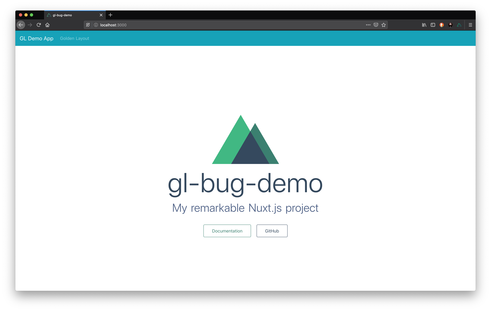
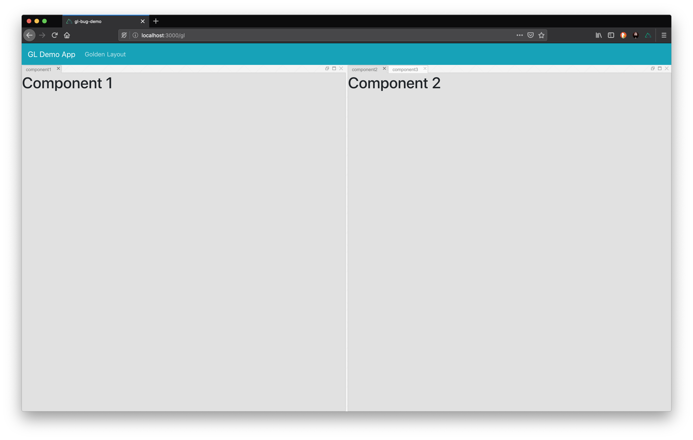
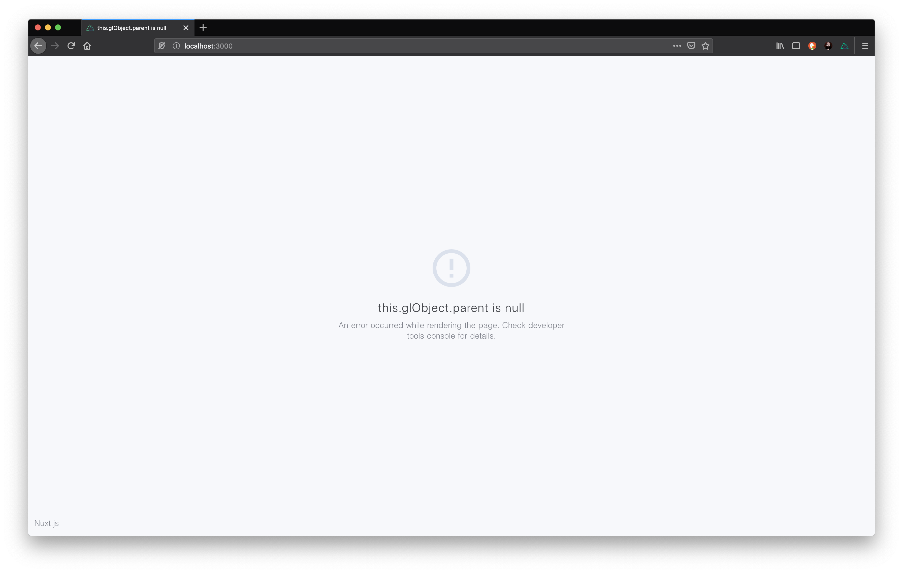

# gl-bug-demo

A demo project to demonstrate the [vue-golden-layout issue](https://github.com/emedware/vue-golden-layout/issues/51).

## Setup

``` bash
# install dependencies
$ npm run install

# serve with hot reload at localhost:3000
$ npm run dev
```

## Reproduce the bug

 - Start the app, go to `http://localhost:3000/`
 - In the navigation bar, click  "Golden Layout" to see the paghe wirth the GL instance
 - Click "GL Demo App" to go to the home view => bug happens




